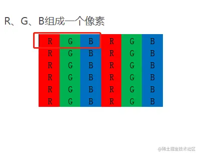
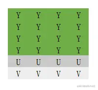
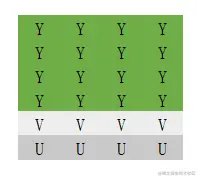
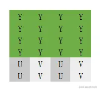
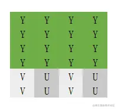

# RGB
RGB是我们平时遇到最多的颜色空间。使用RGB表示的每种颜色都是由红光、绿光、蓝光组合而成的



RGB常常用于图像的存储，但是在视频领域中，RGB就不那么常见了。因为视频其实是由一张张连续的图片序列组成的，我们假设有一个1080p（1920 * 1080）分辨率、
帧率为30帧的视频，如果不对视频进行压缩，并且使用RGB进行存储的话，仅仅一分钟的视频就能达到 （ 1920 * 1080 * 8 * 30 * 60 ）bit （约等于27G），但RGB三个分量之间存在相关性，并不利于压缩，所以需要另一种便于压缩的颜色编码格式

# YUV
## 定义

采用YUV格式的数据，利用人对图像的亮度信息比较敏感，而对于色彩不太敏感，视频可以通过降低色度分量的采样数据，达到降低视频数据量而人眼很难分辨的目的
YUV 颜色编码采用的是 明亮度 和 色度 来指定像素的颜色。

* Y：用于表示明亮度（Luminance或Luma）
* U：用于表示色度（Chrominance或Chroma）
* V：用于表示色度（Chrominance或Chroma）


Y其实就是我们常说的灰度值，是图片的总体轮廓，而U和V则用于描述色彩颜色和颜色饱和度

## 采样方式

* YUV 4:4:4采样，每一个Y对应一组UV分量  4byte + 4byte + 4byte = 12 byte
* YUV 4:2:2采样，每两个Y共用一组UV分量  4byte + 2byte + 2byte = 8  byte
* YUV 4:2:0采样，每四个Y共用一组UV分量  4byte + 1byte + 1byte = 6  byte  

## 存储方式
YUV有packed（打包）和 planar（平面）两种存储方式。
* packed：packed格式是先连续存储所有的Y分量，然后依次交叉储存U、V分量
* planar：planar格式也会先连续存储所有的Y分量，但planar会先连续存储U分量的数据，再连续存储V分量的数据(或者反之)

### YUV444
### YUV422
### YUV420

* YU12(YUV420P)：每四个Y分量共用一个U分量和一个V分量，以planar方式进行存储，先连续储存Y分量，再连续存储U分量，最后连续储存V分量
  


* YV12(YUV420P)：每四个Y分量共用一个U分量和一个V分量，以planar方式进行存储，先连续储存Y分量，再连续存储V分量，最后连续储存U分量
  


* NV12(YUV420SP)：每四个Y分量共用一个U分量和一个V分量，以packed方式进行存储，先连续储存Y分量，再以U、V的顺序交叉存储U分量和Y分量
  


* NV21(YUV420SP)：每四个Y分量共用一个U分量和一个V分量，以packed方式进行存储，先连续储存Y分量，再以V、U的顺序交叉存储U分量和Y分量



## YUV转RGB
* RGB以及YUV的取值范围都缩放到[0,255]时，YUV转RGB的公式如下：
```ts
R = Y + 1.403 * (V − 128)
G = Y + 0.343 * (U − 128) − 0.714 * (V − 128)
B = Y + 1.403 * (U − 128)
```

## 生成YUV格式数据
```shell
ffmpeg -i input.mp4 -ss 00:00:01 -vframes 1 -pix_fmt yuv420p output.yuv
```
这个命令做了以下几件事情：

1. `-i input.mp4`：指定输入的视频文件为`input.mp4`。
2. `-ss 00:00:01`：设置起始时间，从视频的第一帧开始。
3. `-vframes 1`：只输出一帧，即第一帧。
4. `-pix_fmt yuv420p`：将输出设置为YUV格式，其中`yuv420p`是YUV格式的一种，也被称为NV12。
5. `output.yuv`：将输出文件命名为`output.yuv`。